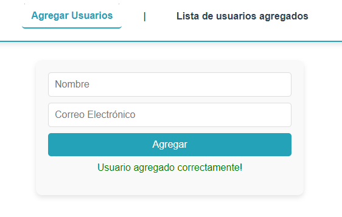
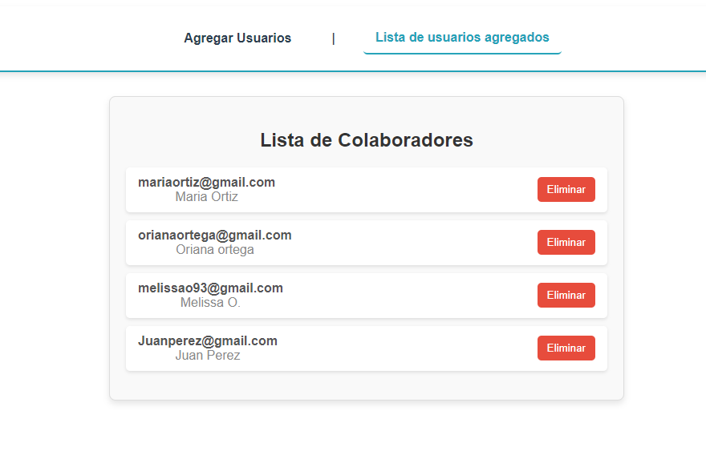

# Desafío Firebase con Vue.js y Vuex

Este proyecto es una aplicación web que utiliza Vue.js, Firebase y Vuex para implementar un sistema CRUD básico. El sistema permite agregar, listar y eliminar usuarios. El objetivo principal es demostrar la integración de Firebase para la persistencia de datos y el uso de Vuex para la gestión del estado global.

## Características

- **Agregar Usuarios**: Permite a los usuarios agregar nuevos colaboradores con nombre y correo electrónico.
- **Lista de Usuarios**: Muestra una lista de usuarios con la opción de eliminar cada uno.
- **Validación de Datos**: Verifica que el correo electrónico ingresado sea válido.
- **Mensajes de Éxito y Error**: Proporciona retroalimentación al usuario sobre las acciones realizadas.

## Tecnologías Utilizadas

- **Vue.js**: Framework de JavaScript para construir interfaces de usuario.
- **Vuex**: Librería para la gestión del estado global en Vue.js.
- **Firebase**: Plataforma para la autenticación y la base de datos en tiempo real.
- **Vue Router**: Enrutador para gestionar las vistas en la aplicación.